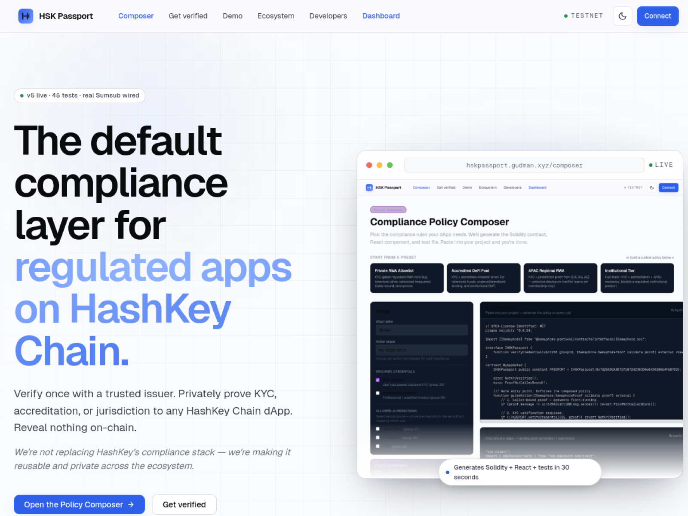

<div align="center">

# HSK Passport

**The default compliance layer for regulated apps on HashKey Chain.**

Verify once with a trusted issuer. Privately prove KYC, accreditation, or jurisdiction to any HashKey Chain dApp. Reveal nothing on-chain.

[](https://hskpassport.gudman.xyz)
[](https://hskpassport.gudman.xyz/composer)
[](https://www.npmjs.com/package/hsk-passport-sdk)
[](#tests)
[](audits/)
[](https://hskpassport.gudman.xyz/demo/fresh)
[](LICENSE)

<p><em>We're not replacing HashKey's compliance stack — we're making it reusable and private across the ecosystem.</em></p>

<a href="https://hskpassport.gudman.xyz">
  
</a>

</div>

---

## Table of contents

- [What is this?](#what-is-this)
- [Quick start](#quick-start)
- [Architecture](#architecture)
- [Per-prover credential freshness (v6)](#per-prover-credential-freshness-v6)
- [The Policy Composer](#the-policy-composer)
- [Works with HashKey Chain's official KYC stack](#works-with-hashkey-chains-official-kyc-stack)
- [How it compares](#how-it-compares)
- [Deployed contracts](#deployed-contracts)
- [Install & run locally](#install--run-locally)
- [Security](#security)
- [Audits](#audits)
- [Tests](#tests)
- [Related work](#related-work)
- [Repo layout](#repo-layout)
- [Links](#links)
- [License](#license)

---

## What is this?

Every regulated dApp on HashKey Chain — silver-backed RWAs, tokenized funds, accredited DeFi — needs KYC. Today every team rebuilds it from scratch and leaks identity on-chain.

HSK Passport is a reusable on-chain layer that turns HashKey's existing compliance infrastructure (Sumsub, the `.key` DID, Exchange KYC SBTs) into zero-knowledge credentials that any dApp can verify with a single `require` line.

**In one sentence**: A user verifies once via Sumsub, gets a Semaphore ZK credential bound to their wallet, and proves eligibility to any compliant dApp — without revealing identity on-chain.

Built for the [HashKey Chain Horizon Hackathon 2026](https://dorahacks.io/hackathon/2045) — **ZKID Track**.

---

## Quick start

Integrate HSK Passport into any HashKey Chain dApp in three steps.

**1. Install the SDK**

```bash
npm install hsk-passport-sdk ethers
```

**2. Gate any Solidity function with one `require`**

```solidity
import {ISemaphore} from "@semaphore-protocol/contracts/interfaces/ISemaphore.sol";

interface IHSKPassport {
    function verifyCredential(uint256 groupId, ISemaphore.SemaphoreProof calldata proof)
        external view returns (bool);
}

contract MyRWA {
    IHSKPassport constant passport =
        IHSKPassport(0x7d2E692A08f2fb0724238396e0436106b4FbD792);

    function mint(ISemaphore.SemaphoreProof calldata proof) external {
        require(proof.message == uint256(uint160(msg.sender)), "bind to caller");
        require(passport.verifyCredential(25, proof), "KYC required");
        _mint(msg.sender, 100e18);
    }
}
```

**3. Generate a proof in your frontend**

```ts
import { HSKPassport } from "hsk-passport-sdk";

const passport = HSKPassport.connect("hashkey-testnet", signer);
const identity = passport.createIdentity(walletSignature);
const caller = await signer.getAddress();
const proof = await passport.generateProof(identity, 25, "mint-rwa", BigInt(caller));

await myRwa.mint(proof);
```

Prefer checkboxes? Generate the same integration — Solidity, React, Hardhat test — in 30 seconds at [**the Policy Composer**](https://hskpassport.gudman.xyz/composer).

---

## Architecture

<p align="center">
  
</p>

1. **User** verifies with Sumsub — documents never touch HSK Passport servers.
2. **Issuer** receives Sumsub's GREEN webhook and adds the user's identity commitment to an on-chain credential group.
3. **User** generates a Groth16 ZK proof in-browser (WASM) that proves group membership without revealing which member.
4. **dApp** calls `passport.verifyCredential(groupId, proof)` and gets a yes/no boolean in ~241k gas — learning nothing about the user.

Caller-bound proofs prevent front-running. Per-action nullifiers prevent sybil attacks within a scope. Credentials are revocable, expirable (on-chain), and governance-controlled (48h timelock).

---

## Per-prover credential freshness (v6)

> Try it live: [**/demo/fresh**](https://hskpassport.gudman.xyz/demo/fresh) · real browser-side Groth16 proof → real on-chain verification on HashKey testnet in ~5 seconds.

Earlier releases enforced credential expiry at the *group* level: the contract required that the group's oldest possible member had not lapsed. That was an approximation — a dApp could not actually know whether the specific anonymous prover's credential was still fresh. v6 closes that gap with a **real per-prover ZK range proof**.

A new circuit — [`circuits/src/credential_freshness.circom`](circuits/src/credential_freshness.circom) — proves four things at once:

1. You derive a valid identity commitment from a private secret.
2. That commitment was inserted into the `FreshnessRegistry`'s Merkle tree by an authorised issuer at some private `issuanceTime`.
3. `issuanceTime >= earliestAcceptable` — the dApp-chosen freshness threshold.
4. A unique `nullifier = Poseidon(secret, scope)` — prevents replay within the dApp's scope.

Nothing about your identity or the exact issuance time leaks. The dApp learns only: *"this prover holds a credential that was issued after the threshold."*

**Circuit stats** — depth-16 Poseidon Merkle + 64-bit comparator, 4,665 wires, 3 public inputs, 1 public output. Groth16 with Hermez ptau 14 (universal) plus a **single-contributor** circuit-specific zkey — hackathon-appropriate; a multi-party circuit ceremony is on the roadmap for mainnet. Browser-side proof generation: ~4.5 seconds (headless Chrome, measured across 5 runs).

**Architecture — additive, no changes to v5**

- [`FreshnessRegistry.sol`](contracts/contracts/freshness/FreshnessRegistry.sol) — per-group rolling Merkle-root history (100 entries), authorised issuers only, two-step ownership.
- [`FreshnessVerifier.sol`](contracts/contracts/freshness/FreshnessVerifier.sol) — snarkjs-generated Groth16 verifier, pragma-aligned.
- [`HSKPassportFreshness.sol`](contracts/contracts/freshness/HSKPassportFreshness.sol) — composer that wires registry + verifier + nullifier replay protection. Exposes `verifyFresh` (state-changing, marks nullifier) and `previewVerifyFresh` (read-only).

The existing `HSKPassport` at `0x7d2E…D792` is untouched. dApps opt into the new flow by calling `HSKPassportFreshness.verifyFresh(...)` alongside the legacy `verifyCredentialWithExpiry`. A v5 issuer integrating v6 also posts `Poseidon(identityCommitment, issuanceTime)` into the `FreshnessRegistry` at issuance time — one additional small-storage tx per credential.

**Tested end-to-end**

- 13 Hardhat tests cover the registry (access control, rolling window, group isolation, two-step ownership).
- 6 Hardhat tests generate real Groth16 proofs via snarkjs against the compiled circuit and verify them via the Solidity verifier (same bytecode as deployed on testnet) — happy path, replay, expiry rejection, unknown root, tampered signals, cross-scope isolation.
- 5 headless-browser runs of [`/demo/fresh`](https://hskpassport.gudman.xyz/demo/fresh) confirm `previewVerifyFresh()` returns `true` on the live testnet contract with 100% determinism.

**Status**

- Circuit, contracts, tests, SDK, and frontend demo are all live.
- Issuer-side auto-registration (backend `auto-issuer` calling `FreshnessRegistry.addLeaf` on every credential issuance) is scoped but **not yet wired** — today only the seeded demo credential exists on-chain. dApps that want v6 today can call `addLeaf` directly from their own issuance path.

---

## The Policy Composer

<a href="https://hskpassport.gudman.xyz/composer">
  
</a>

The Composer turns HSK Passport from a protocol into an **adoption tool**. Any dApp builder ticks compliance rules:

- KYC verified
- Accredited investor
- Jurisdiction in `{HK, SG, AE}`

And gets back a ready-to-deploy Solidity contract, a React gate component, and a Hardhat test. Four one-click presets cover the common patterns: *Private RWA Allowlist · Accredited DeFi Pool · APAC Regional RWA · Institutional Tier*.

Try it live: https://hskpassport.gudman.xyz/composer

---

## Works with HashKey Chain's official KYC stack

HSK Passport is live-compatible with [HashKey Chain's officially-recommended KYC system](https://docs.hashkeychain.net/docs/Build-on-HashKey-Chain/Tools/KYC) — the `IKycSBT` soulbound-token interface served via https://kyc-testnet.hunyuankyc.com/.

The `HashKeyKycSBTAdapter` *(deployed on testnet — see [Deployed contracts](#deployed-contracts))* reads HashKey's `IKycSBT` byte-for-byte and maps the 5 KYC tiers (NONE / BASIC / ADVANCED / PREMIUM / ULTIMATE) onto HSK Passport's credential groups. When hunyuankyc publishes the production address, a single `importer.setKYCSbt(adapter)` call flips the entire pipeline onto real HashKey-verified users — no code change. Interface compliance is proven end-to-end by `contracts/test/KycSBTAdapter.test.ts` (10 passing tests).

---

## How it compares

| | HSK Passport | Most competitors |
|---|:---:|:---:|
| Real Sumsub integration wired end-to-end | ✅ | ❌ (mocked / simulated) |
| Policy Composer generating Solidity + React + tests | ✅ | ❌ |
| HashKey DID bridge + HashKey Exchange KYC importer | ✅ | ❌ |
| Per-prover on-chain credential expiry (real ZK range proof, v6) | ✅ | ❌ |
| Issuer slashing via 48h Timelock | ✅ | ❌ |
| Raw-body HMAC webhook verification *(hardened in [audit Round 3 C1](audits/round-3.md))* | ✅ | ❌ |
| Redacted KYC queue + signed-read auth with nonce replay protection | ✅ | ❌ |
| Dark/light theme + design-token system | ✅ | ❌ |
| Three audit rounds documented publicly in [`audits/`](audits/) | ✅ | ❌ |
| Honest threat model at `/roadmap` | ✅ | ❌ |

---

## Deployed contracts

HashKey Chain testnet (chain id 133), v5:

| Contract | Address |
|---|---|
| HSKPassport | [`0x7d2E…D792`](https://hashkey-testnet.blockscout.com/address/0x7d2E692A08f2fb0724238396e0436106b4FbD792) |
| Semaphore v4 | [`0xd09e…CFE9`](https://hashkey-testnet.blockscout.com/address/0xd09e8Aec6B6A36588E7A105f606A9fe9a134CFE9) |
| CredentialRegistry | [`0x2026…9De1`](https://hashkey-testnet.blockscout.com/address/0x20265dAe4711B3CeF88D7078bf1290f815279De1) |
| IssuerRegistry | [`0x5BbA…b504`](https://hashkey-testnet.blockscout.com/address/0x5BbAe6e90b82c7c51EbA9cA6D844D698dE2eb504) |
| Timelock (48h) | [`0xb07B…3D8A`](https://hashkey-testnet.blockscout.com/address/0xb07Bc78559CbDe44c047b1dC3028d13c4f863D8A) |
| HashKeyDIDBridge | [`0xF072…Ea7a`](https://hashkey-testnet.blockscout.com/address/0xF072D06adcA2B6d5941bde6cc87f41feC5F5Ea7a) |
| HashKeyKYCImporter | [`0x5431…f5B8`](https://hashkey-testnet.blockscout.com/address/0x5431ae6D2f5c3Ad3373B7B4DD4066000D681f5B8) |
| HashKeyKycSBTAdapter *(official IKycSBT bridge)* | [`0xba9c…f794`](https://hashkey-testnet.blockscout.com/address/0xba9c4239A35DA84700ff8c11b35c15e00F6ff794) |
| MockKycSBT *(IKycSBT reference impl)* | [`0x6185…45cD`](https://hashkey-testnet.blockscout.com/address/0x6185225D7cFF75191F93713b44EA09c31de545cD) |
| GatedRWA (hSILVER) | [`0xb695…b9c9`](https://hashkey-testnet.blockscout.com/address/0xb6955cb3e442c4222fFc3b92c322851109d0b9c9) |
| KYCGatedAirdrop (hPILOT) | [`0x71c9…b4b8`](https://hashkey-testnet.blockscout.com/address/0x71c96016CBCAeE7B2Edc8b40Fec45de1d16Fb4b8) |
| KYCGatedLending | [`0x3717…0BFD`](https://hashkey-testnet.blockscout.com/address/0x37179886986bd35a4d580f157f55f249c43A0BFD) |
| JurisdictionGatedPool | [`0x305f…Ce4D`](https://hashkey-testnet.blockscout.com/address/0x305f5F0b44d541785305DaDb372f118A9284Ce4D) |

**v6 — Credential freshness ZK:**

| Contract | Address |
|---|---|
| FreshnessRegistry | [`0xd251…3938`](https://hashkey-testnet.blockscout.com/address/0xd251ecAD1a863299BAD2E25B93377B736a753938) |
| FreshnessVerifier (Groth16) | [`0x59A0…1394`](https://hashkey-testnet.blockscout.com/address/0x59A03fF053464150b066e78d22AEc2F69D081394) |
| HSKPassportFreshness | [`0xFF79…5fBb`](https://hashkey-testnet.blockscout.com/address/0xFF790dE1537a84220cD12ef648650034D4725fBb) |

**Credential groups** *(default validity)*: `KYC_VERIFIED 25 (180 d)` · `ACCREDITED_INVESTOR 26 (365 d)` · `HK_RESIDENT 27` · `SG_RESIDENT 28` · `AE_RESIDENT 29` *(residency never expires)*.

---

## Install & run locally

Requires Node 20+.

**Contracts** (Hardhat, 74 passing tests):

```bash
cd contracts
npm install
npx hardhat test
# Deploy to testnet (requires PRIVATE_KEY env + funded HSK)
npx hardhat run scripts/deploy.ts --network hashkey-testnet
```

**Backend** (Fastify + SQLite indexer):

```bash
cd backend
npm install
# env: RPC_URL, ISSUER_PRIVATE_KEY, SUMSUB_APP_TOKEN, SUMSUB_SECRET_KEY,
#      SUMSUB_WEBHOOK_SECRET, ALLOWED_ORIGINS
npx tsx src/server.ts
# API lives on :4021
```

**Frontend** (Next.js 16):

```bash
cd frontend
npm install
npm run dev
# App lives on :3000
```

**SDK** (published, but can be built locally):

```bash
cd sdk
npm install
npm run build
```

**Circuits** (ZK freshness — optional, requires circom ≥ 2.1.9):

```bash
# Linux/macOS: circom on PATH. Windows: invoke via WSL — build.js handles
# the path translation automatically. circomlib is installed as a dev-dep of
# `contracts` and resolved via circom -l.
cd contracts && npm install    # installs circomlib + snarkjs + poseidon-lite + @zk-kit/imt
node circuits/scripts/build.js
# Output: circuits/build/credential_freshness.{r1cs,wasm,zkey},
#         contracts/contracts/freshness/FreshnessVerifier.sol,
#         frontend/public/freshness/{wasm,zkey,vkey}

# Deploy + seed the demo credential (needs funded deployer + PRIVATE_KEY in contracts/.env)
cd contracts
npx hardhat run scripts/deploy-freshness.ts --network hashkey-testnet
npx hardhat run scripts/seed-freshness-demo.ts --network hashkey-testnet
```

Pre-built artefacts are committed under [`circuits/build/`](circuits/build/) so the demo runs without rebuilding.

---

## Security

- **Caller-bound proofs** — `proof.message == uint256(uint160(msg.sender))` on every gated call prevents front-running.
- **Per-group delegate isolation** — delegates for one group cannot issue in another.
- **Issuer offboarding** — revoking an issuer immediately freezes all their groups and any delegate-issued credentials.
- **Anti-sybil bridges** — DID and KYC importers enforce one-source → one-commitment.
- **Revocation-aware proofs** — client filters `CredentialRevoked` events; revoked credentials fail verification.
- **Single-use nonces** on signed-read endpoints prevent issuer-auth replay within the 5-min window.
- **Raw-body HMAC webhook verification** — Sumsub signatures checked over the original bytes, not a JSON re-stringification.
- **CORS lockdown** — only whitelisted origins.
- **Issuer slashing via 48h Timelock** — misissuance forfeits stake through governance review.

Vulnerability disclosure: [SECURITY.md](SECURITY.md). Threat model: [`/roadmap`](https://hskpassport.gudman.xyz/roadmap).

---

## Audits

Three internal audit rounds, 26 findings total (including 2 CRITICAL caught in Round 3), all CRITICAL / HIGH / MEDIUM closed before submission. Detailed evidence in [`audits/`](audits/):

- [Round 1 — Contracts & initial design](audits/round-1.md)
- [Round 2 — Privacy-safe backend, Composer, per-wallet identities](audits/round-2.md)
- [Round 3 — Security hardening from full independent review](audits/round-3.md)

A formal third-party audit (Trail of Bits / OpenZeppelin / Spearbit) is planned for mainnet and noted on the [public roadmap](https://hskpassport.gudman.xyz/roadmap).

---

## Tests

```
$ npm test
  74 passing
```

The suite includes `SecurityInvariants.test.ts`, `CredentialExpiry.test.ts`, `IssuerSlashing.test.ts`, and `KycSBTAdapter.test.ts` — each targeted at the specific invariants that closed the audit findings or proved an officially-recommended-product integration.

v6 adds **19 new tests**: `FreshnessRegistry.test.ts` (13 — access control, rolling root window, group isolation, two-step ownership) and `CredentialFreshnessZK.test.ts` (6 — real Groth16 proofs generated against the compiled circuit and verified by the Solidity verifier contract, same bytecode as deployed on testnet: happy path, replay, expiry rejection, unknown root, tampered signals, cross-scope isolation).

---

## Related work

HSK Passport builds on and composes with:

- **[Semaphore v4](https://semaphore.pse.dev/)** — the ZK primitive for anonymous group membership (PSE / Ethereum Foundation).
- **[W3C Verifiable Credentials Data Model](https://www.w3.org/TR/vc-data-model-2.0/)** — schema shape for the credential registry.
- **[OpenZeppelin TimelockController](https://docs.openzeppelin.com/contracts/5.x/governance#timelock)** — governance delay mechanism.
- **[Sumsub](https://sumsub.com)** — the real KYC provider; same one HashKey Exchange uses.

Identity projects in adjacent spaces: [Polygon ID / Privado ID](https://www.privado.id/), [World ID](https://world.org/), [Civic](https://www.civic.com/), [Holonym / Human.tech](https://human.tech/), [Zupass](https://zupass.org/), [Passport by Human.tech](https://passport.human.tech/). HSK Passport is HashKey-Chain-native and optimized for regulated RWA / institutional DeFi on that chain specifically.

---

## Repo layout

```
contracts/     Solidity + Hardhat tests (74 passing) + deploy scripts
circuits/      v6 freshness ZK — credential_freshness.circom + build artefacts
backend/       Fastify + SQLite indexer, Sumsub client, auto-issuer, notify
frontend/      Next.js 16 app: /kyc, /composer, /demo, /demo/fresh, /user, /issuer, …
sdk/           TypeScript SDK (published as `hsk-passport-sdk` on npm)
audits/        Three audit rounds with findings and closure evidence
docs/          Architecture diagram, screenshots, demo script, branding
schemas/       W3C VC credential schemas (KYC / accredited / HK resident)
```

## Links

- Live app — https://hskpassport.gudman.xyz
- Policy Composer — https://hskpassport.gudman.xyz/composer
- Roadmap & threat model — https://hskpassport.gudman.xyz/roadmap
- SDK — https://www.npmjs.com/package/hsk-passport-sdk
- Protocol spec — [PROTOCOL.md](PROTOCOL.md)
- Security policy — [SECURITY.md](SECURITY.md)

## License

[MIT](LICENSE) — use, fork, integrate. The default compliance layer should be public goods.
