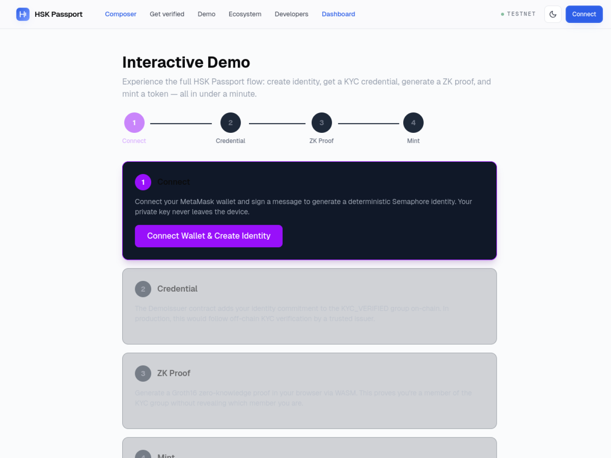

<div align="center">

# HSK Passport

**The default compliance layer for regulated apps on HashKey Chain.**

Verify once with a trusted issuer. Privately prove KYC, accreditation, or jurisdiction to any HashKey Chain dApp. Reveal nothing on-chain.

[](https://hskpassport.gudman.xyz)
[](https://hskpassport.gudman.xyz/composer)
[](https://www.npmjs.com/package/hsk-passport-sdk)
[](#tests)
[](LICENSE)
[](https://hashkey-testnet.blockscout.com/address/0x7d2E692A08f2fb0724238396e0436106b4FbD792)

<p align="center"><em>We're not replacing HashKey's compliance stack — we're making it reusable and private across the ecosystem.</em></p>

<a href="https://hskpassport.gudman.xyz">
  
</a>

</div>

---

## TL;DR

- **Problem**: Every regulated dApp on HashKey Chain rebuilds KYC from scratch and leaks identity on-chain.
- **Solution**: A user verifies once via Sumsub *(the same KYC provider HashKey Exchange uses)*. They get a Semaphore zero-knowledge credential bound to their wallet. Any HashKey Chain dApp can then verify eligibility in a single `require` line — and learn nothing about the user.
- **Why it wins**: The only submission with real Sumsub wired end-to-end, an interactive Policy Composer that generates Solidity + React + tests in 30 seconds, and three rounds of documented audit fixes across 8 live contracts + 45 passing tests.

Built for the [HashKey Chain Horizon Hackathon 2026](https://dorahacks.io/hackathon/2045) — **ZKID Track**.

## Try it in 30 seconds

| | |
|---|---|
| 🌐 Live app | https://hskpassport.gudman.xyz |
| 🧱 Policy Composer | https://hskpassport.gudman.xyz/composer |
| 🎥 Interactive demo | https://hskpassport.gudman.xyz/demo |
| 📦 SDK | `npm i hsk-passport-sdk` — [npm page](https://www.npmjs.com/package/hsk-passport-sdk) |
| 🔗 Main contract | [`0x7d2E…D792`](https://hashkey-testnet.blockscout.com/address/0x7d2E692A08f2fb0724238396e0436106b4FbD792) |

---

## Architecture

<p align="center">
  
</p>

1. User verifies with Sumsub — documents never touch HSK Passport servers.
2. Sumsub fires a webhook to the issuer; the issuer wallet adds the user's identity commitment to an on-chain credential group.
3. The user generates a Groth16 ZK proof in their browser (WASM).
4. Any dApp calls `passport.verifyCredential(groupId, proof)` and gets a yes/no boolean in ~241k gas — learning nothing about the user.

---

## The Policy Composer — the strategic anchor

No other ZKID submission has this. The Composer turns HSK Passport from a protocol into an **adoption tool**. Any dApp builder ticks compliance rules:

- KYC verified
- Accredited investor
- Jurisdiction in `{HK, SG, AE}`

And gets back a ready-to-deploy Solidity contract, a React frontend component, and a Hardhat test — all in 30 seconds.

<a href="https://hskpassport.gudman.xyz/composer">
  
</a>

**Presets**: `Private RWA Allowlist` · `Accredited DeFi Pool` · `APAC Regional RWA` · `Institutional Tier` — one click, every compliance pattern.

---

## How we compare

| | HSK Passport | Most competitors |
|---|:---:|:---:|
| Real Sumsub integration wired end-to-end | ✅ | ❌ (mocked / simulated) |
| Policy Composer generating Solidity + React + tests | ✅ | ❌ |
| HashKey DID bridge + HashKey Exchange KYC importer | ✅ | ❌ |
| On-chain credential expiry (`verifyCredentialWithExpiry`) | ✅ | ❌ |
| Issuer slashing via 48h Timelock | ✅ | ❌ |
| Raw-body HMAC webhook verification | ✅ | ❌ |
| Redacted KYC queue + signed-read auth | ✅ | ❌ |
| Dark/light theme + design-token system | ✅ | ❌ |
| Three audit rounds documented publicly | ✅ | ❌ |
| Honest threat model at `/roadmap` | ✅ | ❌ |

---

## The demo flow (one minute)

1. `/kyc` → connect wallet → Sumsub sandbox widget runs (same provider HashKey Exchange uses).
2. Webhook fires → backend auto-issues the credential on-chain.
3. `/composer` → tick `KYC + (HK || SG || AE)` → copy the generated Solidity.
4. `/demo` → generate ZK proof in-browser → mint `hSILVER` through the gated dApp.
5. `/user` → "Verified Identity" card fetched live from Sumsub *(zero stored on our side)*.

<a href="https://hskpassport.gudman.xyz/demo">
  
</a>

---

## Developer integration

Gate any function behind ZK KYC in one `require`:

```solidity
import {ISemaphore} from "@semaphore-protocol/contracts/interfaces/ISemaphore.sol";

interface IHSKPassport {
    function verifyCredential(uint256 groupId, ISemaphore.SemaphoreProof calldata proof)
        external view returns (bool);
}

contract MyRWA {
    IHSKPassport constant passport =
        IHSKPassport(0x7d2E692A08f2fb0724238396e0436106b4FbD792);

    function mint(ISemaphore.SemaphoreProof calldata proof) external {
        // 1. Bind proof to caller — prevents front-running.
        require(proof.message == uint256(uint160(msg.sender)), "bind to caller");
        // 2. Check KYC credential.
        require(passport.verifyCredential(25, proof), "KYC required");
        // 3. Your logic.
        _mint(msg.sender, 100e18);
    }
}
```

Frontend:

```ts
import { HSKPassport } from "hsk-passport-sdk";

const passport = HSKPassport.connect("hashkey-testnet", signer);
const identity = passport.createIdentity(walletSignature);
const callerAddress = await signer.getAddress();
const proof = await passport.generateProof(identity, 25, "mint-rwa", BigInt(callerAddress));
```

Or use the [**Policy Composer**](https://hskpassport.gudman.xyz/composer) to generate the entire integration in 30 seconds.

---

## What's deployed (HashKey Chain testnet, v5)

| Contract | Address |
|---|---|
| HSKPassport | [`0x7d2E…D792`](https://hashkey-testnet.blockscout.com/address/0x7d2E692A08f2fb0724238396e0436106b4FbD792) |
| Semaphore v4 | [`0xd09e…CFE9`](https://hashkey-testnet.blockscout.com/address/0xd09e8Aec6B6A36588E7A105f606A9fe9a134CFE9) |
| CredentialRegistry | [`0x2026…9De1`](https://hashkey-testnet.blockscout.com/address/0x20265dAe4711B3CeF88D7078bf1290f815279De1) |
| IssuerRegistry | [`0x5BbA…b504`](https://hashkey-testnet.blockscout.com/address/0x5BbAe6e90b82c7c51EbA9cA6D844D698dE2eb504) |
| Timelock (48h) | [`0xb07B…3D8A`](https://hashkey-testnet.blockscout.com/address/0xb07Bc78559CbDe44c047b1dC3028d13c4f863D8A) |
| HashKeyDIDBridge | [`0xF072…Ea7a`](https://hashkey-testnet.blockscout.com/address/0xF072D06adcA2B6d5941bde6cc87f41feC5F5Ea7a) |
| HashKeyKYCImporter | [`0x5431…f5B8`](https://hashkey-testnet.blockscout.com/address/0x5431ae6D2f5c3Ad3373B7B4DD4066000D681f5B8) |
| GatedRWA (hSILVER) | [`0xb695…b9c9`](https://hashkey-testnet.blockscout.com/address/0xb6955cb3e442c4222fFc3b92c322851109d0b9c9) |
| KYCGatedAirdrop (hPILOT) | [`0x71c9…b4b8`](https://hashkey-testnet.blockscout.com/address/0x71c96016CBCAeE7B2Edc8b40Fec45de1d16Fb4b8) |
| KYCGatedLending | [`0x3717…0BFD`](https://hashkey-testnet.blockscout.com/address/0x37179886986bd35a4d580f157f55f249c43A0BFD) |
| JurisdictionGatedPool | [`0x305f…Ce4D`](https://hashkey-testnet.blockscout.com/address/0x305f5F0b44d541785305DaDb372f118A9284Ce4D) |

**Credential groups** *(default validity)*: KYC_VERIFIED `25` (180 d) · ACCREDITED_INVESTOR `26` (365 d) · HK_RESIDENT `27` · SG_RESIDENT `28` · AE_RESIDENT `29` (no expiry).

---

## Security — what we enforce today

- **Caller-bound proofs** — `proof.message == uint256(uint160(msg.sender))` on every gated call prevents front-running.
- **Per-group delegate isolation** — delegates for one group cannot issue in another.
- **Issuer offboarding** — revoking an issuer immediately freezes all their groups and any delegate-issued credentials.
- **Anti-sybil bridges** — DID and KYC importers enforce one-source → one-commitment.
- **Revocation-aware proofs** — client filters `CredentialRevoked` events; revoked credentials fail verification.
- **Single-use nonce** on signed-read endpoints prevents issuer-auth replay within the 5-min window.
- **Raw-body HMAC webhook verification** — Sumsub signatures checked over the original bytes, not a JSON re-stringification.
- **CORS lockdown** — only whitelisted origins.
- **Issuer slashing via 48h Timelock** — misissuance forfeits stake through governance review.

Three documented audit rounds, all HIGH and MEDIUM findings closed. See [SECURITY.md](SECURITY.md) and the `/roadmap` page for the full threat model.

---

## Honest status

- ✅ **Production-shape**: Sumsub flow, ZK proof generation, on-chain verification, issuer review, credential expiry, HashKey ecosystem bridges.
- ⚠ **Clearly labeled roadmap at [/roadmap](https://hskpassport.gudman.xyz/roadmap)**: blind-issuance for backend-correlation resistance, formal audit, anonymity-set floor enforcement, cross-chain availability, biometric-bound identities.

We document what we don't yet protect against. Most KYC-gated protocols don't.

---

## Tests

```
$ npm test
  45 passing
```

Coverage includes the full security-invariant suite: issuer offboarding, delegate escalation, anti-sybil bridges, credential expiry enforcement, slashing authority.

---

## Tech stack

- **ZK**: Semaphore v4 (Groth16, EdDSA, LeanIMT); bn128 precompiles verified on HashKey Chain.
- **Contracts**: Solidity 0.8.24, Hardhat, OpenZeppelin `TimelockController` + `Ownable`.
- **Frontend**: Next.js 16, TypeScript, Tailwind v4, ethers v6; design-token system with dark/light theme.
- **Backend**: Fastify + better-sqlite3 indexer; Sumsub HMAC raw-body webhook verification; signed-read auth.
- **KYC provider**: Sumsub (real integration — same provider HashKey Exchange uses).

---

## Repo layout

```
contracts/     Solidity, Hardhat tests (45 passing), deploy scripts (v5)
backend/       Fastify + SQLite indexer, Sumsub client, auto-issuer
frontend/      Next.js 16 app: /kyc, /composer, /demo, /user, /issuer, /bridge, …
sdk/           TypeScript SDK (published as `hsk-passport-sdk` on npm)
docs/          Architecture diagram, screenshots
```

## Links

- 🌐 Live demo — https://hskpassport.gudman.xyz
- 🧱 Policy Composer — https://hskpassport.gudman.xyz/composer
- 🗺 Roadmap & threat model — https://hskpassport.gudman.xyz/roadmap
- 📦 SDK — https://www.npmjs.com/package/hsk-passport-sdk
- 📖 Protocol spec — [PROTOCOL.md](PROTOCOL.md)
- 🛡 Security policy — [SECURITY.md](SECURITY.md)

## License

MIT — use, fork, integrate. The default compliance layer should be public goods.
